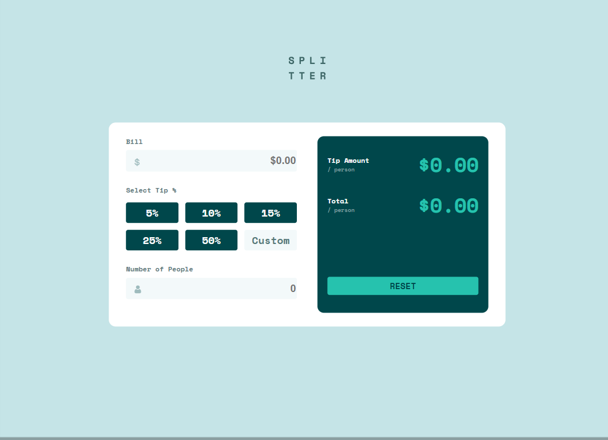

# 📝 Calculadora de propinas

Esta es una solución al [desafío de la aplicación de calculadora de propinas en Frontend Mentor](https://www.frontendmentor.io/challenges/qr-code-component-iux_sIO_H). Los desafíos de Frontend Mentor te ayudan a mejorar tus habilidades de programación creando proyectos realistas.

## 🔎 Descripción general

### 📷 Captura de pantalla

### 🔗 Links
- [URL de la solución](https://www.frontendmentor.io/solutions/aplicacin-calculadora-con-js-08C7Y_Tjxn)
- [URL del sitio en vivo](https://braismarquez2025.github.io/tip-calculator-app-main/)

## 💡 Mi proceso

### 🔧 Llevado a cabo con

- HTML
- SCSS
- Javascript

### 📈 Lo que aprendí
He aprendido a personalizar los inputs de forma más avanzada y a seleccionar en javascript lo que necesito con el uso de event. Lo que más me ha costado hacer ha sido el porcentaje personalizado. Cambiar de un div a un input me ha costado pero el resultado creo que ha sido bueno.

### 🚀 Desarrollo continuo
Voy a aprender a desarrollar javascript de forma más avanzada, con este proyecto he cogido soltura en el uso de eventos pero aún no uso funciones, he de empezar a implementarlas.

### ✌️ Autor 
- 💼 GitHub - https://github.com/braismarquez2025
- ✉️ Gmail - braismarquez2003@gmail.com
- 👤 Usuario de Frontend - [@braismarquez2025](https://www.frontendmentor.io/profile/braismarquez2025)

